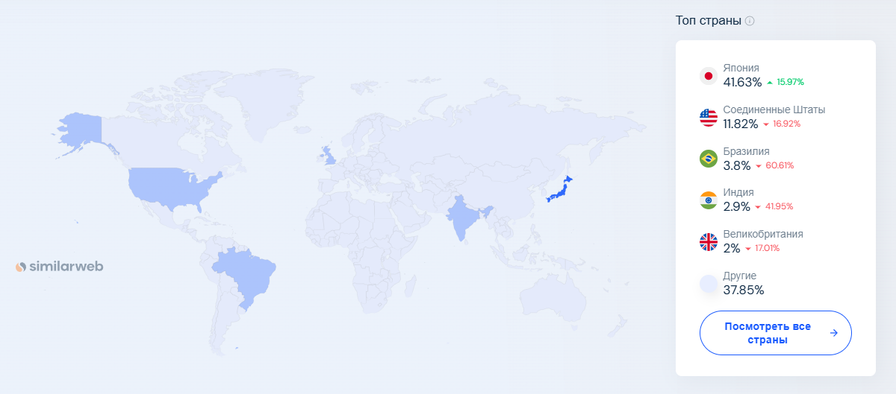

# Google Maps: Описание проекта

## 1. Тема и целевая аудитория

### **Тема проекта**

Google Maps — это сервис картографии и навигации, предоставляющий пользователям информацию о геолокации, маршрутах, пробках и панорамах улиц.

### **Целевая аудитория**

#### **Пользователи:**

-   **Обычные пользователи** — построение маршрутов, просмотр пробок, поиск заведений.
-   **Водители и логистические компании** — планирование маршрутов, навигация в реальном времени, просмотр пробок.
-   **Бизнесы** — отображение заведений и их продвижение.
-   **Разработчики** — использование API для интеграции карт в свои сервисы.

##### Веб-трафик по странам

-   **100M+ MAU (сайт maps.google.com)**[^1]
-   **1B+ MAU в целом на всех устройствах**[^2]
-   **доступно в 250+ странах**[^1]

---

## Функционал MVP

### **Ключевые функции MVP**

1. **Отображение карты**
2. **Поиск мест и организаций**
3. **Построение маршрутов**
4. **Определение местоположения пользователя**
5. **Информация о местах**

---

## Ключевые продуктовые решения

1. **Кэширование (загрузка) карт** — оффлайн-доступ и оптимизация трафика.
2. **Анализ пробок** — обработка данных от пользователей и мобильных сенсоров.

---

## Список источников

[^1]: [Анализ веб-трафика maps.google.com](https://www.similarweb.com/website/maps.google.com/#geography)
[^2]: [Почему Google? Сайт Google с описанием преимуществ Google Maps](https://mapsplatform.google.com/why-google/)
