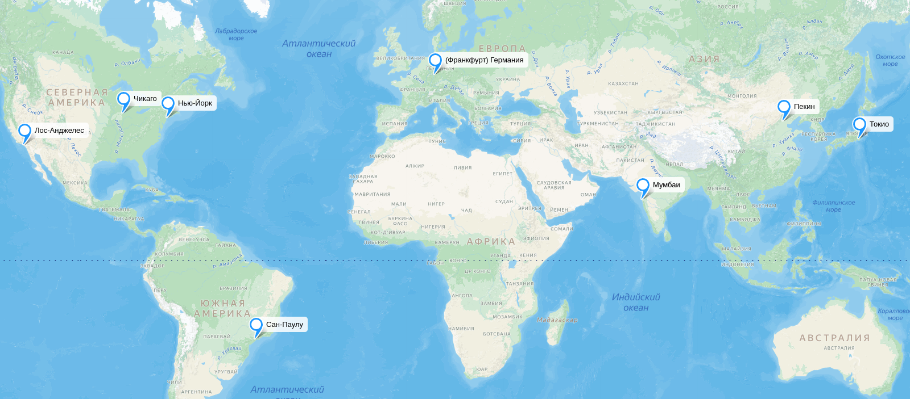
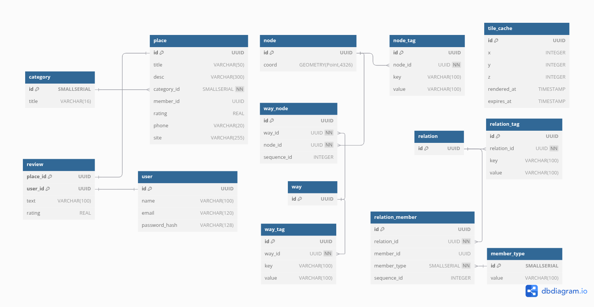

# Google Maps

# 1. Тема и целевая аудитория

### **Тема проекта**

Google Maps — это сервис картографии и навигации, предоставляющий пользователям информацию о геолокации, маршрутах, пробках и панорамах улиц.

### Продуктовые метрики

-   **1B+ MAU**[^2]
-   **95% трафика на веб-сайт приходится на мобильные устройства, 4% — на пк**[^1]
-   **средняя продолжительность посещения веб-версии — 24 секунды** [^1]
-   **доступно в 250+ странах**[^2]
-   **250M+ бизнесов и мест**[^2]
-   **100M+ обновлений информации каждый день** [^2]
-   **(по США) приложением Google Maps используется пользователем 50 раз в месяц, в среднем сессия длится 3 минуты**[^3]
-   **500M пользователей добавляют новую информацию каждый год**[^4]
-   **За май 2023 года сайт Google Maps посетили 196.8 млн раз**[^5]
-   **В среднем за день в Google Play приложение скачивают около 7 млн раз**[^6]
-   **Google Maps в среднем использует около 5-10 MB данных за каждый час поездки**[^7]

### **Целевая аудитория**

#### Трафик по странам

##### Mobile

##### Desktop

---

## Функционал MVP

### **Ключевые функции MVP**

1. **Отображение карты**
2. **Поиск мест и организаций**
3. **Построение маршрутов**
4. **Определение местоположения пользователя**
5. **Информация о местах**

---

## Ключевые продуктовые решения

1. **Кэширование (загрузка) карт** — оффлайн-доступ и оптимизация трафика.

---

# 2. Расчет нагрузки

## Продуктовые метрики

-   1B+ MAU[^2]
-   Зная Stickiness = 30%[^3], посчитаем DAU = MAU \* 0,3 = 300M

Среднее количество действий пользователя по типам в день:

| **Действие**                        | **Среднее число повторений за день** | **Описание**                                                                                                                                                                                                                                                                           |
| ----------------------------------- | ------------------------------------ | -------------------------------------------------------------------------------------------------------------------------------------------------------------------------------------------------------------------------------------------------------------------------------------- |
| **Отображение карты**               | **2,5**                              | Карта отображается при каждом запуске приложения. В среднем пользователь Google Maps открывает приложение 50 раз в месяц[^3], т. е. ≈ 1,67 раза в день. Учитываем, что некоторые пользователи открывают карту несколько раз за одну сессию, поэтому принимаем **2,5 действия** в день. |
| **Отображение информации о местах** | **3,34**                             | В среднем пользователи запрашивают данные о местах **2 раза за сессию**. Если **1,67 сессии в день**, то это **≈3,34 раза в день**.                                                                                                                                                    |
| **Поиск мест и организаций**        | **2,37**                             | В **71% случаев использования**[^9] пользователи совершают поиск. Предположим, что в среднем за сессию поиск совершают 2 раза. **1,67 \* 71% \* 2 ≈ 2,37**.                                                                                                                            |
| **Построение маршрутов**            | **1,25**                             | **75% пользователей**[^9] строят маршрут при каждом открытии. **1,67 \* 0,75 ≈ 1,25** маршрута в день.                                                                                                                                                                                 |
| **Загрузка оффлайн карт**           | **0,017**                            | Пользователь загружает карты своего региона, после чего обновляет их. Предположим, что выполняется **≈1 раз в 2 месяца**, то есть в день **≈1/60 = 0,017**.                                                                                                                            |

## Технические метрики

### Хранилище

#### Карта

Карты хранятся в виде тайлов (фрагментов изображений или векторных данных), которые загружаются при перемещении по карте. Причем тайлы не рендерятся предварительно, потому что а) объем получается слишком большим; б) доля просмотренных тайлов из всех составляет малые 1.79%. Поэтому тайлы рендерятся динамически, а наиболее использованные тайлы кэшируются.

Согласно информации с сайта OSM[^8] размер кэша составляет 1250 ГБ.

#### Информация о местах

| Поле                     | Описание                      | Средний объем на 1 объект |
| ------------------------ | ----------------------------- | ------------------------- |
| **ID места**             | Уникальный идентификатор      | 16 байт                   |
| **Название**             | Текст (UTF-8)                 | 50 байт                   |
| **Категория**            | Тип места (кафе, отель, парк) | 16 байт                   |
| **Координаты (lat/lon)** | Два float-числа               | 16 байт                   |
| **Часы работы**          | JSON-объект                   | 200 байт                  |
| **Отзывы**               | Список текстовых данных       | ~1 КБ (по 10 отзывов)     |
| **Рейтинг**              | Число с плавающей точкой      | 8 байт                    |
| **Фото**                 | Ссылки на изображения         | ~2 КБ                     |
| **Доп. данные**          | Телефон, сайт, соцсети        | 200 байт                  |

## **Итоговая таблица хранения данных**

| **Тип данных**          | **Кол-во объектов** | **Размер 1 объекта** | **Общий объем** |
| ----------------------- | ------------------- | -------------------- | --------------- |
| **Информация о местах** | ~250 млн[^2]        | ~3 КБ                | ~720 ГБ         |
| **Размер кэша**         |                     |                      | ~1250 ГБ        |

### Сетевой трафик

#### Пиковое потребление в течение суток (в Гбит/с)

Пиковая нагрузка: 40% пользователей активны одновременно
| **Тип трафика** | **Размер 1 запроса (МБ)** | **Число запросов в секунду (RPS) в пике** | **Пиковый трафик (Гбит/с)** |
| ------------------------- | ------------------------- | ----------------------------------------- | --------------------------- |
| **Информация о местах** | 0,003 МБ | (300M DAU \* 2,5 (число действий) \* 40%) / (3\*60) ≈ 1,67 М | **39 Гбит/с** |
| **Поиск мест** | 50 байт (название организации) \* 10 результатов = 0,5 КБ | (300M \* 2,37 \* 40%) / (3\*60) ≈ 1,58 M | **6 Гбит/с** |
| **Построение маршрутов** | Возьмем маршрут в 10 км: возможно 200 точек \* 16 байт = 3,2 КБ + метаданные маршрута 2 КБ = 5,2 КБ | (300M \* 1,25 \* 40%) / (3\*60) ≈ 0,83 M | **33 Гбит/с** |
| **Отображение карты** | при экране 1080p при масштабировании 16 уровня загружается 9-12 тайлов за раз. 12 \* 0,6 = 7,2 КБ | (300M \* 2,5 \* 40%) / (3\*60) ≈ 1,67 M | **91,7 Гбит/с** |

<!-- #### Суммарный суточный (Гбайт/сутки)

| **Тип трафика**           | **Размер 1 запроса (МБ)** | **Число действий в день** | **Суточный трафик (ПБ)** | **Суточный трафик (ГБ/сутки)** |
| ------------------------- | ------------------------- | ------------------------- | ------------------------ | ------------------------------ |
| **Загрузка карт (тайлы)** | 0,2 МБ                    | 33.3M \* 2,5               | **0,25 ПБ**              | **250 000 ГБ**                 |
| **Информация о местах**   | 0,05 МБ                   | 33.3M \* 2,5               | **0,062 ПБ**             | **62 500 ГБ**                  |
| **Поиск мест**            | 0,1 МБ                    | 33.3M \* 1,5               | **0,075 ПБ**             | **75 000 ГБ**                  |
| **Построение маршрутов**  | 0,15 МБ                   | 33.3M \* 1,2               | **0,09 ПБ**              | **90 000 ГБ**                  | -->

# 3. Глобальная балансировка нагрузки

## Обоснования расположения ДЦ (влияние на продуктовые метрики)

Возьмем распределение пользователей по странам с сайта hypestat[^10]:

Из этих данных, делаем вывод, что больше всего трафика приходится на пользователей из США. После идут Индия, Китай, Бразилия и Япония.

Таким образом, логичнее всего расположить ДЦ в крупных городах перечисленных выше стран:

-   США, Нью-Йорк (Восток США)
-   США, Лос-Анджелес (Запад США)
-   США, Чикаго (Северо-Запад США)
-   США, Техас (Даллас) – баланс между западом и востоком США
-   Индия, Мумбаи
-   Китай, Пекин
-   Бразилия, Сан-Паулу
-   Япония, Токио

| Тип запроса                                 | Нью-Йорк | Лос-Анджелес | Чикаго | Даллас | Мумбаи | Пекин | Сан-Паулу | Токио |
| ------------------------------------------- | -------- | ------------ | ------ | ------ | ------ | ----- | --------- | ----- |
| **Отображение карты** (1,67M)               | 250.5K   | 250.5K       | 250.5K | 250.5K | 167K   | 167K  | 167K      | 167K  |
| **Отображение информации о местах** (1,67M) | 250.5K   | 250.5K       | 250.5K | 250.5K | 167K   | 167K  | 167K      | 167K  |
| **Поиск мест и организаций** (1.58M)        | 237K     | 237K         | 237K   | 237K   | 158K   | 158K  | 158K      | 158K  |
| **Построение маршрутов** (0.83M)            | 124.5K   | 124.5K       | 124.5K | 124.5K | 83K    | 83K   | 83K       | 83K   |

## Схема DNS балансировки

Для балансировки по миру будет использоваться **Geo-Based DNS**. Он будет перенаправлять пользователей в нужные регионы.

## Схема Anycast балансировки

Anycast — это метод маршрутизации, при котором один IP-адрес назначен нескольким серверам в разных местах.

Anycast сети будут использоваться в США, так как в штатах расположено несколько дата-центов. Маршрутизация на уровне сети будет направлять запрос к ближайшему узлу, помимо этого будет распределяться трафик тем самым справляться с DDoS атаками.

# 4. Локальная балансировка нагрузки

В качестве балансировщика выбран балансировщик уровня L7, так как он позволяет кэшировать карты и данные, а также сжимать данные.

В качестве решения будет использоваться NGINX благодаря его высокой производительности, гибкости настройки и поддержке множества протоколов. В качестве стратегии балансировки предлагается использовать round robin.

### Обеспечение отказоустойчивости

1. Kubernetes при отказе одного пода автоматически запускает новый.

2. Для большей отказойустойчивости Kubernetes будут масштабироваться пропорционально нагрузке

3. Kubernetes использует Service Discovery для определения доступных сервисов, и при отказе одного сервера другие продолжают работать, а клиент автоматически направляет запросы на работающие.

4. Nginx распределяет нагрузку между оставшимися серверами, чтобы снизить влияние отказа одного из них на пользователя.

# 5. Логическая схема БД[^11][^12]

| **Таблица**         | **Описание**                                                                                    | Размер (байты) |
| ------------------- | ----------------------------------------------------------------------------------------------- | -------------- |
| **Category**        | Содержит категории мест (например, рестораны, магазины, парки)                                  | 18             |
| **Place**           | Описывает места (название, описание, рейтинг, контакты, категория и т. д.)                      | 428            |
| **Review**          | Отзывы пользователей о местах (текст, рейтинг)                                                  | 252            |
| **User**            | Информация о пользователях (ID, имя, email, логин, хеш пароля)                                  | 434            |
| **node**            | Представляет географические точки (широта, долгота)                                             | 36             |
| **node_tag**        | Дополнительные атрибуты узлов (например, название улицы, высота и т. д.)                        | 232            |
| **way**             | Объединяет узлы в линии (например, дороги, реки)                                                | 16             |
| **way_node**        | Связь между узлами и путями (промежуточная таблица, определяет последовательность узлов в пути) | 50             |
| **way_tag**         | Хранит дополнительные атрибуты путей                                                            | 232            |
| **relation**        | Определяет сложные связи между объектами (например, маршруты, границы)                          | 16             |
| **relation_tag**    | Дополнительные свойства для связей                                                              | 232            |
| **relation_member** | Описывает участников отношений (узлы, пути, другие связи)                                       | 54             |
| **member_type**     | Тип участника в отношении (узел, путь, связь)                                                   | 102            |

### Требования консистентности

-   В таблицах `place` и `relation_member` поле `member_id` может ссылаться как на node, так и на way, или relation. Поэтому `relation`, `node` и `way` обязаны иметь **уникальные PK, которые не повторяются друг с другом**!

# Список источников

[^1]: [Анализ веб-трафика maps.google.com](https://www.similarweb.com/website/maps.google.com/#geography)
[^2]: [Почему Google? Сайт Google с описанием преимуществ Google Maps](https://mapsplatform.google.com/why-google/)
[^3]: [Leading US Map and Navigation Smartphone Apps, Ranked by Monthly Unique Users, Aug 2019](https://www.emarketer.com/chart/234831/leading-us-map-navigation-smartphone-apps-ranked-by-monthly-unique-users-aug-2019)
[^4]:
    [20 things you didn’t know you could do with Google Maps
    ](https://blog.google/products/maps/20-years-google-maps-20-features/)

[^5]:
    [Google Maps Statistics 2024 By Usage, Revenue, Accuracy, Traffic Data, Trends, Web Usage and API Usage
    ](https://www.enterpriseappstoday.com/stats/google-maps-statistics.html#:~:text=Google%20Maps%20website%20had%20a%20record%20number%20of%20visits.%20Google%20Maps%20website%20had%20around%20196.8%20million%20visits%20total%20in%20May%202023.)

[^6]: [Google Maps on AppBrain](https://www.appbrain.com/app/google-maps/com.google.android.apps.maps)
[^7]:
    [Сколько данных используют Google Maps?
    ](https://truely.com/blog/how-much-data-does-google-maps-use#:~:text=with%20Standard%20Mode-,5%2D10%20MB,-Navigation%20with%20Traffic)

[^8]: [Open steet maps: Tile disk usage](https://wiki.openstreetmap.org/wiki/Tile_disk_usage)
[^9]: [Как часто россияне используют геосервисы](https://iom.anketolog.ru/2020/02/12/geoservisy)
[^10]: [HypeStat: Google Maps](https://hypestat.com/info/maps.google.com)
[^11]: [OSM: DB Schema](https://wiki.openstreetmap.org/wiki/Openstreetmap-website/Database_schema)
[^12]: [OSM: Элементы](https://wiki.openstreetmap.org/wiki/RU:%D0%AD%D0%BB%D0%B5%D0%BC%D0%B5%D0%BD%D1%82%D1%8B)
